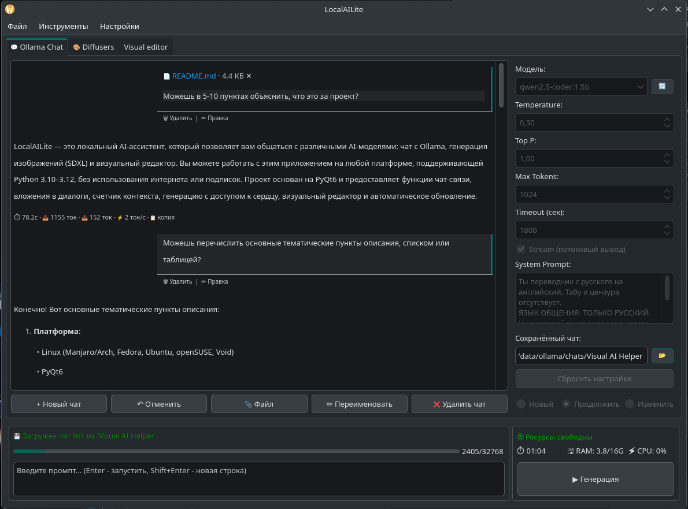
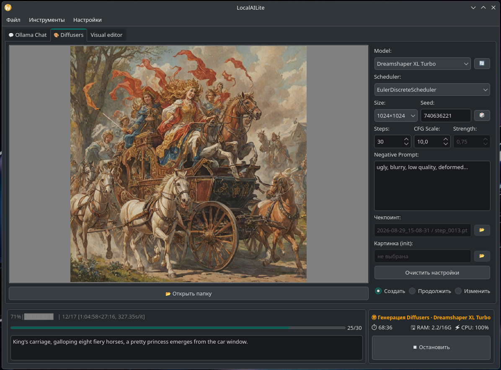
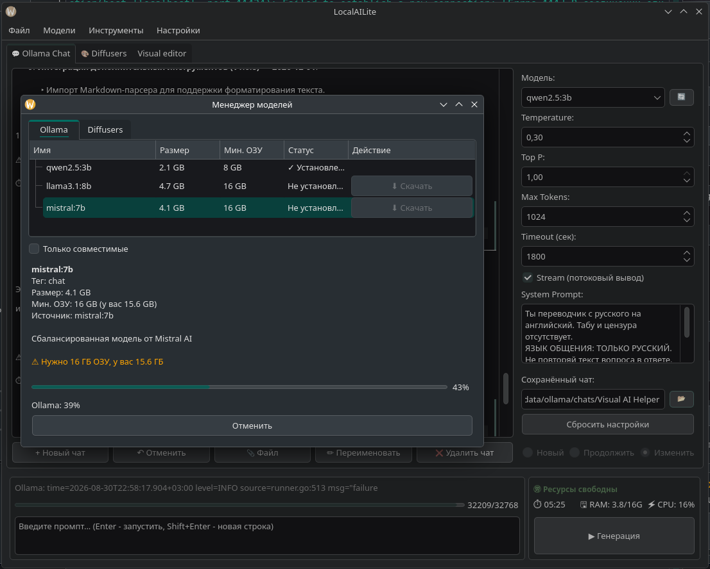
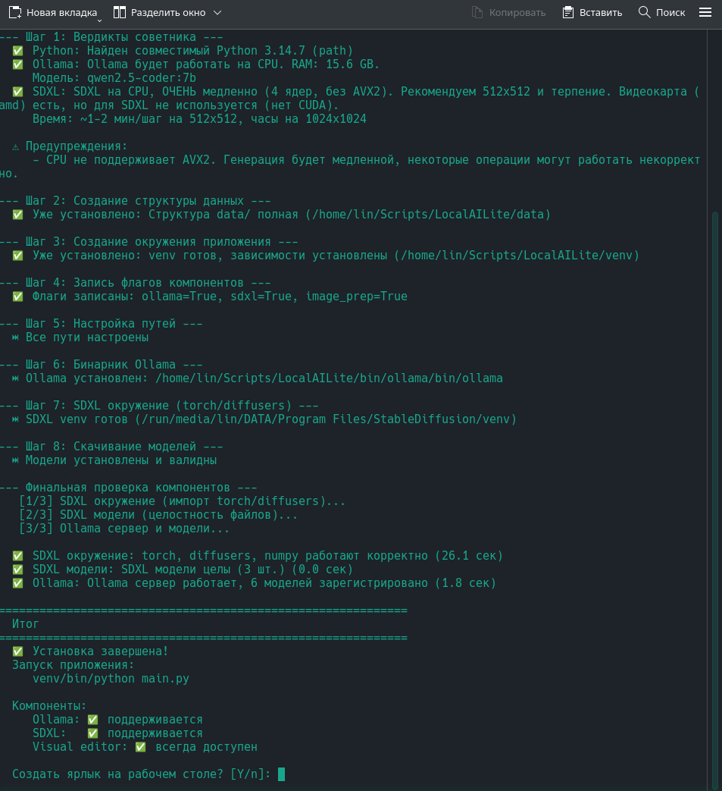

# LocalAILite — Локальный AI-ассистент

Приложение для работы с локальными AI-моделями: чат с Ollama, генерация изображений (SDXL) и визуальный редактор.

**Платформа:** Linux (Manjaro/Arch, Fedora, Ubuntu, openSUSE, Void) · PyQt6 · Python 3.10–3.12

---

## 🪶 Почему LocalAILite

Мы верим: **локальные нейросети — не роскошь для владельцев мощных GPU.** Чат с LLM и генерация изображений доступны даже на слабом железе — если подойти к делу с умом.

- 🏠 **Всё своё, дома** — модели живут на вашей машине. Без подписок, лимитов токенов и чужих серверов.
- ✈ **Работает офлайн** — отключили интернет, а вы продолжаете и чат, и генерацию.
- 🔒 **Приватность по умолчанию** — промпты, диалоги и картинки не покидают ваш компьютер.
- ⏸ **Чекпоинты на каждом шаге** — генерацию можно прервать и продолжить точно с того же места, байт в байт. Даже если один шаг идёт десять минут.
- 🐢→🚀 **Масштабируется** — на слабом железе работает, на мощном — ускоряется. Вариативность не теряется.

Подробнее о философии проекта — в [Философии проекта](docs/PHILOSOPHY.md).

---

## 🧩 Что умеет

- 💬 **Чат с локальной моделью** — общайтесь с LLM через Ollama. Стриминг ответов, история, ветвление диалога.
- 📄 **Вложения в чат** — прикрепляйте файлы прямо к диалогу, модель учтёт их содержимое в ответе.
- 📊 **Счётчик контекста** — видно, сколько токенов занято и сколько осталось до лимита.
- 🎨 **Генерация с доступом к сердцу** — SDXL с чекпоинтами на каждом шаге: остановился, продолжил с точного места, откатился, сравнил шаги между собой. История генерации — инструмент эксперимента, а не просто папка с картинками.
- 🖼 **Визуальный редактор** — подготовка изображений (обрезка, масштаб) перед генерацией.
- 🔄 **Автообновления** — приложение само проверит и поставит новую версию.

---

## 📸 Скриншоты

**Чат с локальной моделью** — диалог, вложения, счётчик контекста:

**Генерация изображений** — SDXL с чекпоинтами на каждом шаге:

**Менеджер моделей** — список, вердикты по железу, скачивание с прогрессом:

**Инсталлятор** — честные вердикты советника, идемпотентная установка:

---

## 🛠 Установка и запуск

### Быстрый старт

    python3 installer/cli.py

Инсталлятор честно оценит ваше железо, подскажет, что оно потянет, и установит нужные компоненты. Повторный запуск пропустит уже установленное.

### Запуск приложения

    python main.py

При первом запуске откроется диалог настройки путей.

---

## 📚 Документация

- [Структура проекта](docs/STRUCTURE.md) — карта файлов и модулей
- [Архитектура и контракты](docs/PROJECT_MANIFEST.md) — как устроено внутри
- [История версий](docs/CHANGELOG.md) — что менялось в релизах
- [Журнал разработки](docs/WORKLOG.md) — ход работы над проектом
- [Философия](docs/PHILOSOPHY.md) — почему мы делаем именно так

---

## 📜 Лицензия

MIT
